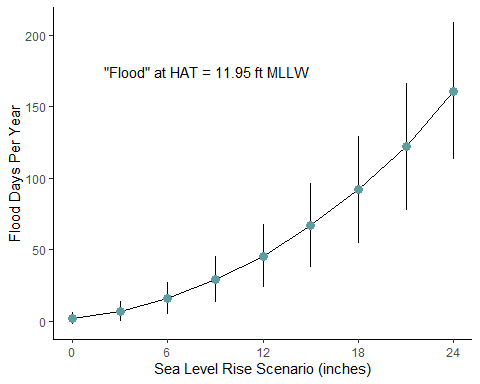

Graphics Explaining Flood Forecasting
================
Curtis C. Bohlen, Casco Bay Estuary Partnership
Revised, 1/18/2022

-   [Introduction](#introduction)
-   [Install Libraries](#install-libraries)
-   [Retreive Portland Tide Data](#retreive-portland-tide-data)


# Introduction

This repository develops some simple graphics to help explain how a
relatively modest increase in sea level can result in substantial
increases in the frequency of “minor” tidal flooding.

It relies on a package developed by CBEP staff to analyze NOAA tide
gauge data for sea level trends and future flood frequencies. The
package accesses NOAA on-line data, so an internet connection is needed
to

# Install Libraries

``` r
library(tidyverse)
#> -- Attaching packages --------------------------------------- tidyverse 1.3.1 --
#> v ggplot2 3.3.5     v purrr   0.3.4
#> v tibble  3.1.6     v dplyr   1.0.7
#> v tidyr   1.1.4     v stringr 1.4.0
#> v readr   2.1.1     v forcats 0.5.1
#> -- Conflicts ------------------------------------------ tidyverse_conflicts() --
#> x dplyr::filter() masks stats::filter()
#> x dplyr::lag()    masks stats::lag()
library(SLRSIM)
theme_set(theme_classic())
```

# Retreive Portland Tide Data

``` r
if(! file.exists('portland_tides.rds') && ! exists('portland_tides')) {
  portland_tides <- retrieve_data(8418150, 1983, 2001, .which = 'observed',
                                  .datum = "MLLW", .units = 'english', 
                                  .timefmt = 'lst', 
                                  .tz = get_tz(8418150, .type = 'string'))
  saveRDS(portland_tides, 'portland_tides.rds')
} else {
  portland_tides <- readRDS('portland_tides.rds')
}
```

``` r
portland_daily_max <- portland_tides %>%
  filter(! is.na(water_level)) %>%
  mutate(thedate = as.Date(datetime, tz = get_tz(8418150, .type = 'string'))) %>%
  group_by(thedate) %>%
  summarize(dailymax = max(water_level, na.rm = TRUE),
            .groups = 'drop') %>%
  mutate(year = as.numeric(format(thedate, format = '%Y')))
```

``` r
(HAT <- get_hat(8418150, .units = 'english',  .datum = 'MLLW'))
#> [1] 11.945
```

``` r
plt <- ggplot(portland_daily_max, aes(thedate, dailymax)) +
  geom_point(color = "cadetblue4", alpha = 0.2) +
  geom_hline(yintercept = HAT, color = 'grey15', size = 1.5) +
  theme_classic(base_size = 12)
```

``` r
plt + 
  annotate('text', x = as.Date('1995-01-01'), y = 12.5, 
           label = 'Flood Level = HAT',
           hjust = 0, size = 4) +
  ylim(c(7,15)) +
  ylab('Highest Daily Water Level\n(ft MLLW)') +
  xlab('')
```


``` r
results <- floodcast_tub(portland_tides, datetime, water_level, 
              .slr = seq(0,2,0.25), .fldlvl = HAT)
results <- as_tibble(results) %>%
  slice_head(n=9) %>%
  mutate(val = seq(0,2, 0.25))

results$Mean
#> [1]   2.052632   6.842105  16.052632  29.473684  45.789474  67.052632  92.000000
#> [8] 122.210526 161.000000
#> attr(,"slr")
#> [1] 0.00 0.25 0.50 0.75 1.00 1.25 1.50 1.75 2.00
#> attr(,"years")
#> [1] 19
#> attr(,"span")
#>        start          end 
#> "1983-01-01" "2001-12-31"
```

``` r
for (val in seq(0, 2, 0.25)) {
plt <- ggplot(portland_daily_max, aes(thedate, dailymax + val)) +
  geom_point(color = "cadetblue4", alpha = 0.2) +
  geom_hline(yintercept = HAT, color = 'grey15', size = 2) +
  theme_classic(base_size = 12) +
  annotate('text', x = as.Date('1995-01-01'), y = 12.5, 
           label = 'Flood Level = HAT',
           hjust = 0, size = 4) +
  annotate('text', x = as.Date('1982-01-01'), y = 14.5, 
           label = paste('SLR =', val*12, 'inches'),
           hjust = 0, size = 4) +
  annotate('text', x = as.Date('1982-01-01'), y = 14, 
           label = paste('Floods per Year =', 
                         round(results$Mean[results$val == val],1)),
           hjust = 0, size = 4) +
  ylim(c(7,15)) +
  ylab('Highest Daily Water Level\n(ft MLLW)') +
  xlab('')

  fn <- paste0('flood_demo_', val*12, '.png')
ggsave(fn, type = 'cairo', width = 5, height = 4)
}
#> Warning: Removed 1 rows containing missing values (geom_point).
```

``` r
plt
#> Warning: Removed 1 rows containing missing values (geom_point).
```


``` r
ggplot(results, aes(x = val*12, y = Mean)) +
  geom_line() +
  geom_linerange(aes(x = val*12, ymin = Mean - 1.96*SD, ymax = Mean + 1.96*SD)) +
  geom_point(size = 3, color = "cadetblue") +
  ylab('Flood Days Per Year') +
  scale_x_continuous(breaks = seq(0,24,6)) +
  annotate('text', x = 2, y = 175, hjust = 0, label = '"Flood" at HAT = 11.95 ft MLLW') +
  xlab('Sea Level Rise Scenario (inches)')
```



``` r
ggsave('floods_by_SLR.png', type = 'cairo', width = 5, height = 4)
```

``` r
for (highlight in seq(0, 2, 0.25)) {
  plt <- ggplot(results, aes(x = val*12, y = Mean)) +
    geom_line() +
    geom_linerange(aes(x = val*12, ymin = Mean - 1.96*SD, ymax = Mean + 1.96*SD)) +
    geom_point(aes(color = (highlight == val)), size = 3) +
    scale_color_discrete(type = c("cadetblue", 'yellow2')) +
    scale_x_continuous(breaks = seq(0,24,6)) +
    ylab('Flood Days Per Year') +
    annotate('text', x = 2, y = 175, hjust = 0, label = '"Flood" at HAT = 11.95 ft MLLW') +
    xlab('Sea Level Rise Scenario (inches)') +
    theme(legend.position = 'none')
  fn <- paste0('flood_days', highlight*12, '.png')
  ggsave(fn, type = 'cairo', width = 5, height = 4)
}
```

``` r
plt
```


